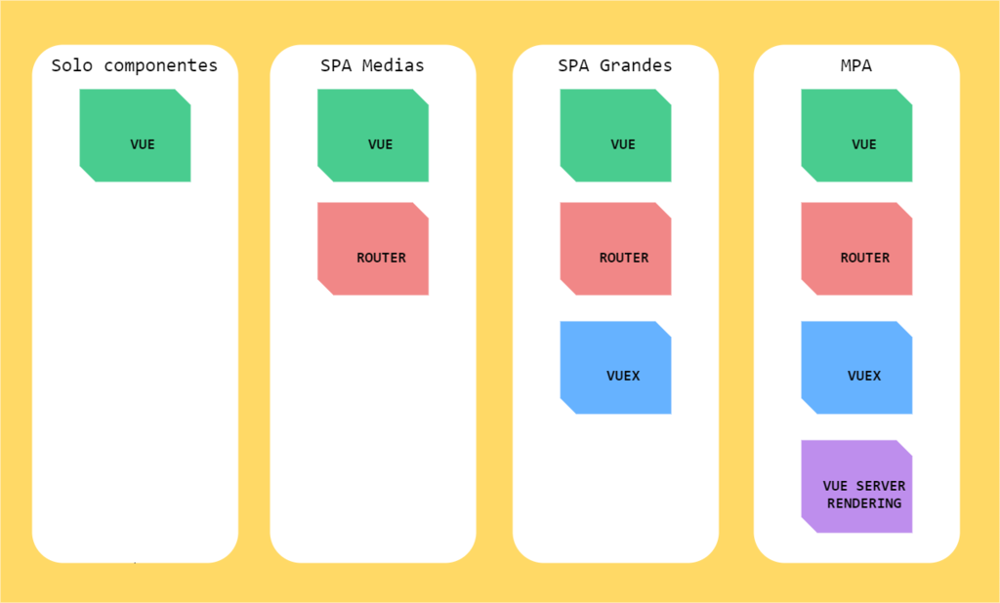

# Vuejs

### Table of Contents
+ [Introduction](#introduction)
+ [What is Vue.js?](#what-is-vue.js)
  * [Your first Vue App](#your-first-vue-app)
  * [Using the GUI](#using-the-gui)
+ [Getting Started](#getting-started)
  * [Declarative Rendering](#declarative-rendering)
  * [Conditionals and Loops](#conditionals-and-loops)
  * [Handling User Input](#handling-user-input)
  * [Composing with Components](#composing-with-components)
+ [The Vue Instance](#the-vue-instance)
  * [Data and Methods](#data-and-methods)
  * [Instance Lifecycle Hooks](#instance-lifecycle-hooks)
+ [Template Syntax](#template-syntax)
  * [Interpolations](#interpolations)
    * [Attributes](#attributes)
    * [Using JavaScript Expressions](#using-javascript-expressions)
  * [Directives](#directives)
    * [Arguments](#arguments)
    * [Modifiers](#modifiers)
  * [Shorthands](#shorthands)
+ [Computed Properties and Watchers](#computed-properties-and-watchers)
  * [Computed Caching vs Methods](#computed-caching-vs-methods)
  * [Computed vs Watched Property](#computed-vs-watched-property)
  * [Computed Setter](#computed_setter)
  * [Watchers](#watchers)
+ [Class and Style Bindings](#class-and-style-bindings)
  * [Binding HTML Classes](#binding-html-classes)
    * [Object Syntax](#object-syntax)
    * [Array Syntax](#array-syntax)
    * [With Components](#with-components)
  * [Binding Inline Styles](#binding-inline-styles)
    * [Object Syntax](#object-syntax)
    * [Array Syntax](#array-syntax)
+ [Conditional Rendering](#conditional-rendering)
  * [if sentence](#if-sentence)
  * [show sentence](#show-sentence)
+ [Event Handling](#event-handling)
  * [Listening to Events](#listening-to-events)
  * [Method Event Handlers](#method-event-handlers)
  * [Event Modifiers](#event-modifiers)
  * [Key Modifiers](#key-modifiers)
+ [Form Input Bindings](#form-input-bindings)
  * [Text](#text)
  * [Multiline text](#multiline-text)
  * [Checkbox](#checkbox)
  * [Radio](#radio)
  * [Select](#select)
+ [Component Registration](#component-registration)
  * [Component Names](#component-names)
    * [Name Casing](#name-casing)
  * [Global Registration](#global-registration)
  * [Local Registration](#local-registration)
  * [Module Systems](#module-systems)
+ [Single File Components](#single-file-components)
+ [Modular Framework](#modular-framework)
  * [Vue Router](#vue-router)
  * [Vuex](#vuex)
+ [A Little Vue Project](#a-little-vue-project)

## Introduction

## What is Vue.js?

Vue (pronounced **/vjuː/**, like view) is a progressive framework for building user interfaces. Unlike other monolithic frameworks, Vue is designed from the ground up to be incrementally adoptable. The core library is focused on the view layer only, and is easy to pick up and integrate with other libraries or existing projects. 



[5 reasons to learn VueJS](https://www.genbeta.com/desarrollo/por-que-elegir-vuejs-5-razones-para-considerarlo-nuestro-proximo-framework-de-referencia)

[Why we moved from Angular 2 to Vue.js (and why we didn’t choose React) a Rever's employee story](https://medium.com/reverdev/why-we-moved-from-angular-2-to-vue-js-and-why-we-didnt-choose-react-ef807d9f4163)

### Your first Vue App

If you've never created a Vue.js application, now you are going to create one.

Just follow these simple steps:
1. Install Vue CLI  
>Vue CLI is the Standard Tooling for Vue.js Development.  
~~~bash
➜ npm install -g @vue/cli
~~~
[](https://asciinema.org/a/bJjE4brSvkeZOYFpu4KeZekXM)

2. Create a Project
~~~bash
➜ vue create giphy-client
~~~  

[](https://asciinema.org/a/207556)

[PWA - Progressive Web Applications](https://naturaily.com/blog/pwa-vue-cli-3)

3. Start the project

~~~bash
➜ npm run serve
~~~

[](https://asciinema.org/a/YTYI6pDIYAjUEkJXf63Wpthp0)

**[Back to top](#table-of-contents)**

### Using the GUI

You can also create and manage projects using a graphical interface with the vue ui command:

~~~shell
➜ vue ui
~~~

[](https://asciinema.org/a/gRaUFRmcOidCCQwWl16Ta5umz)

**[Back to top](#table-of-contents)**

## Getting Started

>The Installation page provides more options of installing Vue. Note: We do not recommend that beginners start with vue-cli, especially if you are not yet familiar with Node.js-based build tools.

**[Back to top](#table-of-contents)**

### Declarative Rendering

At the core of Vue.js is a system that enables us to declaratively render data to the DOM using straightforward template syntax:

~~~html
<div id="app">
  {{ message }}
</div>
~~~

~~~js
var app = new Vue({
  el: '#app',
  data: {
    message: 'Hello Vue!'
  }
})
~~~

~~~html
<div id="app-2">
  <span v-bind:title="message">
    Hover your mouse over me for a few seconds
    to see my dynamically bound title!
  </span>
</div>
~~~

~~~js
var app2 = new Vue({
  el: '#app-2',
  data: {
    message: 'You loaded this page on ' + new Date().toLocaleString()
  }
})
~~~

The v-bind attribute you are seeing is called a **directive**. 

**[Back to top](#table-of-contents)**

### Conditionals and Loops

#### if sentence
~~~html
<div id="app-3">
  <span v-if="seen">Now you see me</span>
</div>
~~~

~~~js
var app3 = new Vue({
  el: '#app-3',
  data: {
    seen: true
  }
})
~~~

#### 

~~~html
<div id="app-4">
  <ol>
    <li v-for="todo in todos">
      {{ todo.text }}
    </li>
  </ol>
</div>
~~~

~~~js
var app4 = new Vue({
  el: '#app-4',
  data: {
    todos: [
      { text: 'Learn JavaScript' },
      { text: 'Learn Vue' },
      { text: 'Build something awesome' }
    ]
  }
})
~~~

**[Back to top](#table-of-contents)**

### Handling User Input

To let users interact with your app, we can use the v-on directive to attach event listeners that invoke methods on our Vue instances:

~~~html
<div id="app-5">
  <p>{{ message }}</p>
  <button v-on:click="reverseMessage">Reverse Message</button>
</div>
~~~

~~~js
var app5 = new Vue({
  el: '#app-5',
  data: {
    message: 'Hello Vue.js!'
  },
  methods: {
    reverseMessage: function () {
      this.message = this.message.split('').reverse().join('')
    }
  }
})
~~~

~~~html
<div id="app-6">
  <p>{{ message }}</p>
  <input v-model="message">
</div>
~~~

~~~js
var app6 = new Vue({
  el: '#app-6',
  data: {
    message: 'Hello Vue!'
  }
})
~~~

**[Back to top](#table-of-contents)**

### Composing with Components

The component system is another important concept in Vue, because it’s an abstraction that allows us to build large-scale applications composed of small, self-contained, and often reusable components. If we think about it, almost any type of application interface can be abstracted into a tree of components:


~~~js
// Define a new component called todo-item
Vue.component('todo-item', {
  template: '<li>This is a todo</li>'
})
~~~

~~~html
<ol>
  <!-- Create an instance of the todo-item component -->
  <todo-item></todo-item>
</ol>
~~~

~~~js
Vue.component('todo-item', {
  // The todo-item component now accepts a
  // "prop", which is like a custom attribute.
  // This prop is called todo.
  props: ['todo'],
  template: '<li>{{ todo.text }}</li>'
})
var app7 = new Vue({
  el: '#app-7',
  data: {
    groceryList: [
      { id: 0, text: 'Vegetables' },
      { id: 1, text: 'Cheese' },
      { id: 2, text: 'Whatever else humans are supposed to eat' }
    ]
  }
})
~~~

~~~html
<div id="app-7">
  <ol>
    <!--
      Now we provide each todo-item with the todo object
      it's representing, so that its content can be dynamic.
      We also need to provide each component with a "key",
      which will be explained later.
    -->
    <todo-item
      v-for="item in groceryList"
      v-bind:todo="item"
      v-bind:key="item.id">
    </todo-item>
  </ol>
</div>
~~~

**[Back to top](#table-of-contents)**

### [The Vue Instance](#the-vue-instance)

Every Vue application starts by creating a new Vue instance with the Vue function:

~~~js
var vm = new Vue({
  // options
})

A Vue application consists of a root Vue instance created with new Vue, optionally organized into a tree of nested, reusable components. For example, a todo app’s component tree might look like this:
~~~

~~~text
Root Instance
└─ TodoList
   ├─ TodoItem
   │  ├─ DeleteTodoButton
   │  └─ EditTodoButton
   └─ TodoListFooter
      ├─ ClearTodosButton
      └─ TodoListStatistics
~~~

**[Back to top](#table-of-contents)**

## Data and Methods

When a Vue instance is created, it adds all the properties found in its data object to Vue’s reactivity system. When the values of those properties change, the view will “react”, updating to match the new values.

~~~js
// Our data object
var data = { 
  a: 1 
  , nombre : "oscar"
};

var methods = {
  sayHello(){
    return `Hello ${this.nombre}`
  }
};

// The object is added to a Vue instance
var vm = new Vue(
  {
    data: data
    //data
  }
);

// Getting the property on the instance
// returns the one from the original data
vm.a == data.a // => true

// Setting the property on the instance
// also affects the original data
vm.a = 2
data.a // => 2

// ... and vice-versa
data.a = 3
vm.a // => 3
~~~
**[Back to top](#table-of-contents)**

## Instance Lifecycle Hooks

Each Vue instance goes through a series of initialization steps when it’s created - for example, it needs to set up data observation, compile the template, mount the instance to the DOM, and update the DOM when data changes. Along the way, it also runs functions called lifecycle hooks, giving users the opportunity to add their own code at specific stages.

* beforeCreate
* created
* beforeMount
* mounted
* beforeUpdate
* updated
* beforeDestroy


**[Back to top](#table-of-contents)**

## Template Syntax

Vue.js uses an HTML-based template syntax that allows you to declaratively bind the rendered DOM to the underlying Vue instance’s data. All Vue.js templates are valid HTML that can be parsed by spec-compliant browsers and HTML parsers.

Under the hood, Vue compiles the templates into Virtual DOM render functions. Combined with the reactivity system, Vue is able to intelligently figure out the minimal number of components to re-render and apply the minimal amount of DOM manipulations when the app state changes.

**[Back to top](#table-of-contents)**

### Interpolations

#### Text

The most basic form of data binding is text interpolation using the “Mustache” syntax (double curly braces):

~~~html
<span>Message: {{ msg }}</span>
<h1>{{getMessage()}}</h1>
<h2>{{concatWords('asdf','asdf')}}</h2>
~~~

**[Back to top](#table-of-contents)**

#### Attributes

Mustaches cannot be used inside HTML attributes. Instead, use a v-bind directive:

~~~html
<div v-bind:id="dynamicId"></div>
~~~

~~~html
<button v-bind:disabled="isButtonDisabled">Button</button>
~~~

If isButtonDisabled has the value of null, undefined, or false, the disabled attribute will not even be included in the rendered `<button>` element.

**[Back to top](#table-of-contents)**

#### Using JavaScript Expressions

So far we’ve only been binding to simple property keys in our templates. But Vue.js actually supports the full power of JavaScript expressions inside all data bindings:

~~~js
{{ number + 1 }}

{{ ok ? 'YES' : 'NO' }}

{{ message.split('').reverse().join('') }}

<div v-bind:id="'list-' + id"></div>
~~~

**[Back to top](#table-of-contents)**

### Directives

Directives are special attributes with the v- prefix. Directive attribute values are expected to be a single JavaScript expression (with the exception of v-for, which will be discussed later). A directive’s job is to reactively apply side effects to the DOM when the value of its expression changes. Let’s review the example we saw in the introduction:

~~~html
<p v-if="seen">Now you see me</p>
~~~

**[Back to top](#table-of-contents)**

#### Arguments

Some directives can take an “argument”, denoted by a colon after the directive name. For example, the v-bind directive is used to reactively update an HTML attribute:

~~~html
<a v-bind:href="url"> ... </a>
~~~

~~~html
<a v-on:click="doSomething"> ... </a>
Here the argument is the event name to listen to. We will talk about event handling in more detail too.
~~~

**[Back to top](#table-of-contents)**

#### Modifiers

Modifiers are special postfixes denoted by a dot, which indicate that a directive should be bound in some special way. For example, the .prevent modifier tells the v-on directive to call event.preventDefault() on the triggered event:

~~~html
<form v-on:submit.prevent="onSubmit"> ... </form>
~~~

**[Back to top](#table-of-contents)**

### Shorthands

The v- prefix serves as a visual cue for identifying Vue-specific attributes in your templates. This is useful when you are using Vue.js to apply dynamic behavior to some existing markup, but can feel verbose for some frequently used directives. At the same time, the need for the v- prefix becomes less important when you are building a SPA where Vue.js manages every template. Therefore, Vue.js provides special shorthands for two of the most often used directives, v-bind and v-on:

**v-bind Shorthand**

~~~html
<!-- full syntax -->
<a v-bind:href="url"> ... </a>

<!-- shorthand -->
<a :href="url"> ... </a>
~~~~

**v-on Shorthand**

~~~html
<!-- full syntax -->
<a v-on:click="doSomething"> ... </a>

<!-- shorthand -->
<a @click="doSomething"> ... </a>
~~~

**[Back to top](#table-of-contents)**

## Computed Properties and Watchers

In-template expressions are very convenient, but they are meant for simple operations. Putting too much logic in your templates can make them bloated and hard to maintain.

~~~html
<div id="example">
  {{ message.split('').reverse().join('') }}
</div>
~~~

At this point, the template is no longer simple and declarative. You have to look at it for a second before realizing that it displays message in reverse. The problem is made worse when you want to include the reversed message in your template more than once.

That’s why for any complex logic, you should use a computed property.

~~~html
<div id="example">
  <p>Original message: "{{ message }}"</p>
  <p>Computed reversed message: "{{ reversedMessage }}"</p>
</div>
~~~

~~~js
var vm = new Vue({
  el: '#example',
  data: {
    message: 'Hello'
  },
  computed: {
    // a computed getter
    reversedMessage: function () {
      // `this` points to the vm instance
      return this.message.split('').reverse().join('')
    }
  }
})
~~~

**[Back to top](#table-of-contents)**

### Computed Caching vs Methods

You may have noticed we can achieve the same result by invoking a method in the expression:

~~~html
<p>Reversed message: "{{ reverseMessage() }}"</p>
~~~

~~~js
// in component
methods: {
  reverseMessage: function () {
    return this.message.split('').reverse().join('')
  }
}
~~~

The difference is that computed properties **are cached based on their dependencies**. 

A computed property will only re-evaluate when some of its dependencies have changed.

~~~js
computed: {
  now: function () {
    return Date.now()
  }
}
~~~

**[Back to top](#table-of-contents)**

### Computed vs Watched Property

Vue does provide a more generic way to observe and react to data changes on a Vue instance: watch properties. When you have some data that needs to change based on some other data, it is tempting to overuse watch - especially if you are coming from an **AngularJS background**. 

~~~~html
<div id="demo">{{ fullName }}</div>
~~~~

~~~js
var vm = new Vue({
  el: '#demo',
  data: {
    firstName: 'Foo',
    lastName: 'Bar',
    fullName: 'Foo Bar'
  },
  watch: {
    firstName: function (val) {
      this.fullName = val + ' ' + this.lastName
    },
    lastName: function (val) {
      this.fullName = this.firstName + ' ' + val
    }
  }
})
~~~

~~~js
var vm = new Vue({
  el: '#demo',
  data: {
    firstName: 'Foo',
    lastName: 'Bar'
  },
  computed: {
    fullName: function () {
      return this.firstName + ' ' + this.lastName
    }
  }
})~~
~~~

**[Back to top](#table-of-contents)**

### Computed Setter

Computed properties are by default getter-only, but you can also provide a setter when you need it:

~~~js
// ...
computed: {
  fullName: {
    // getter
    get: function () {
      return this.firstName + ' ' + this.lastName
    },
    // setter
    set: function (newValue) {
      var names = newValue.split(' ')
      this.firstName = names[0]
      this.lastName = names[names.length - 1]
    }
  }
}
// ...
~~~

**[Back to top](#table-of-contents)**

### Watchers

~~~html
<div id="watch-example">
  <p>
    Ask a yes/no question:
    <input v-model="question">
  </p>
  <p>{{ answer }}</p>
</div>
~~~

~~~js
//...
watch: {
  // whenever question changes, this function will run
  question: function (newQuestion, oldQuestion) {
    this.answer = 'Waiting for you to stop typing...'
    this.debouncedGetAnswer()
  }
}
, created: function () {
  // _.debounce is a function provided by lodash to limit how
  // often a particularly expensive operation can be run.
  // In this case, we want to limit how often we access
  // yesno.wtf/api, waiting until the user has completely
  // finished typing before making the ajax request. To learn
  // more about the _.debounce function (and its cousin
  // _.throttle), visit: https://lodash.com/docs#debounce
  this.debouncedGetAnswer = _.debounce(this.getAnswer, 500)
}
, methods: {
  getAnswer:  function () {
    if (this.question.indexOf('?') === -1) {
      this.answer = 'Questions usually contain a question mark. ;-)'
      return
    }
    this.answer = 'Thinking...'
    var vm = this
    axios.get('https://yesno.wtf/api')
      .then(function (response) {
        vm.answer = _.capitalize(response.data.answer)
      })
      .catch(function (error) {
        vm.answer = 'Error! Could not reach the API. ' + error
      })
  }
}
//...
~~~

**[Back to top](#table-of-contents)**

## Class and Style Bindings

A common need for data binding is manipulating an element’s class list and its inline styles. Since they are both attributes, we can use v-bind to handle them: we only need to calculate a final string with our expressions. 

**[Back to top](#table-of-contents)**

### Binding HTML Classes

#### Object Syntax

We can pass an object to v-bind:class to dynamically toggle classes:

~~~html
<div 
  class="static"
  v-bind:class="{ active: isActive, 'text-danger': hasError }">
</div>
<div v-bind:class="classObject"></div>
~~~

~~~js
data: {
  isActive: true
  , hasError: false
  , classObject: {
    active: true
    , 'text-danger': false
  }
}
~~~

**[Back to top](#table-of-contents)**

#### Array Syntax

We can pass an array to v-bind:class to apply a list of classes:

~~~html
<div v-bind:class="[activeClass, errorClass]"></div>
~~~

~~~js
//...
data: {
  activeClass: 'active'
  , errorClass: 'text-danger'
}
//...
~~~

You can toggle a class in the list conditionally, you can do it with a ternary expression:

~~~html
<div v-bind:class="[isActive ? activeClass : '', errorClass]"></div>
<!--using object syntax-->
<div v-bind:class="[{ active: isActive }, errorClass]"></div>
~~~

**[Back to top](#table-of-contents)**

### Binding Inline Styles

**[Back to top](#table-of-contents)**

#### Object Syntax

The object syntax for v-bind:style is pretty straightforward - it looks almost like CSS, except it’s a JavaScript object. You can use either camelCase or kebab-case (use quotes with kebab-case) for the CSS property names:

~~~html
<div v-bind:style="{ color: activeColor, fontSize: fontSize + 'px' }"></div>
<!-- using a complete object to replace the previous template -->
<div v-bind:style="styleObject"></div>
~~~

~~~js
data: {
  activeColor: 'red'
  , fontSize: 30
  , styleObject: {
    color: 'red',
    fontSize: '13px'
  }
}
~~~

**[Back to top](#table-of-contents)**

#### Array Syntax

The array syntax for v-bind:style allows you to apply multiple style objects to the same element:

~~~html
<div v-bind:style="[baseStyles, overridingStyles]"></div>
<!-- Using Multiple Values -->
<div v-bind:style="{ display: ['-webkit-box', '-ms-flexbox', 'flex'] }"></div>
~~~

**[Back to top](#table-of-contents)**

## Conditional Rendering

### if sentence

These directive is useful to show or hide sections depending of an boolean or expression value.

~~~html
<h1 v-if="ok">Yes</h1>
~~~~

It is also possible to add an “else block” with v-else:

~~~html
<h1 v-if="ok">Yes</h1>
<h1 v-else>No</h1>
~~~

It is also possible to use a chain of "if-else":

~~~html
<div v-if="type === 'A'">
  A
</div>
<div v-else-if="type === 'B'">
  B
</div>
<div v-else-if="type === 'C'">
  C
</div>
<div v-else>
  Not A/B/C
</div>
~~~

**[Back to top](#table-of-contents)**

### show sentence

Another option for conditionally displaying an element is the v-show directive. The usage is largely the same:

~~~html
<h1 v-show="ok">Hello!</h1>
~~~

The difference is that an element with **v-show** will always be rendered and remain in the **DOM**; **v-show** only toggles the `display` CSS property of the element.

**[Back to top](#table-of-contents)**

## Event Handling

### Listening to Events

We can use the `v-on` directive to listen to DOM events and run some JavaScript when they’re triggered.

~~~html
<div id="example-1">
  <button v-on:click="counter += 1">Add 1</button>
  <p>The button above has been clicked {{ counter }} times.</p>
</div>
~~~

~~~js
var example1 = new Vue({
  el: '#example-1',
  data: {
    counter: 0
  }
})
~~~

**[Back to top](#table-of-contents)**

### Method Event Handlers

The logic for many event handlers will be more complex though, so keeping your JavaScript in the value of the v-on attribute isn’t feasible. That’s why v-on can also accept the name of a method you’d like to call.

~~~html
<div id="example-2">
  <!-- `greet` is the name of a method defined below -->
  <button v-on:click="greet">Greet</button>
  <!-- using inline handlers -->
  <button v-on:click="say('hi')">Say hi</button>
  <!-- accesing the original DOM event -->
  <button v-on:click="warn('Form cannot be submitted yet.', $event)">
    Submit  
  </button>
</div>
~~~

~~~js
var example2 = new Vue({
  el: '#example-2',
  data: {
    name: 'Vue.js'
  },
  // define methods under the `methods` object
  methods: {
    greet: function (event) {
      // `this` inside methods points to the Vue instance
      alert('Hello ' + this.name + '!')
      // `event` is the native DOM event
      if (event) {
        alert(event.target.tagName)
      }
    }
    , say: function (message) {
      alert(message)
    }
    , warn: function (message, event) {
      // now we have access to the native event
      if (event) event.preventDefault()
      alert(message)
    }
  }
})
~~~

**[Back to top](#table-of-contents)**

### Event Modifiers

It is a very common need to call event.preventDefault() or event.stopPropagation() inside event handlers. Although we can do this easily inside methods, it would be better if the methods can be purely about data logic rather than having to deal with DOM event details.

To address this problem, Vue provides event modifiers for v-on. Recall that modifiers are directive postfixes denoted by a dot.

* .stop
* .prevent
* .capture
* .self
* .once
* .passive

~~~html
<!-- the click event's propagation will be stopped -->
<a v-on:click.stop="doThis"></a>

<!-- the submit event will no longer reload the page -->
<form v-on:submit.prevent="onSubmit"></form>

<!-- modifiers can be chained -->
<a v-on:click.stop.prevent="doThat"></a>

<!-- just the modifier -->
<form v-on:submit.prevent></form>

<!-- use capture mode when adding the event listener -->
<!-- i.e. an event targeting an inner element is handled here before being handled by that element -->
<div v-on:click.capture="doThis">...</div>

<!-- only trigger handler if event.target is the element itself -->
<!-- i.e. not from a child element -->
<div v-on:click.self="doThat">...</div>
~~~

**[Back to top](#table-of-contents)**

### Key Modifiers

When listening for keyboard events, we often need to check for common key codes. Vue also allows adding key modifiers for v-on when listening for key events:

Here’s the full list of key modifier aliases:
* .enter
* .tab
* .delete (captures both “Delete” and “Backspace” keys)
* .esc
* .space
* .up
* .down
* .left
* .right

~~~html
<!-- only call `vm.submit()` when the `keyCode` is 13 -->
<input v-on:keyup.13="submit">

<!-- same as above -->
<input v-on:keyup.enter="submit">

<!-- also works for shorthand -->
<input @keyup.enter="submit">
~~~

You can use the following modifiers to trigger mouse or keyboard event listeners only when the corresponding modifier key is pressed:

* .ctrl
* .alt
* .shift
* .meta

~~~html
<!-- Alt + C -->
<input @keyup.alt.67="clear">

<!-- Ctrl + Click -->
<div @click.ctrl="doSomething">Do something</div>
~~~

**[Back to top](#table-of-contents)**

## Form Input Bindings

You can use the v-model directive to create two-way data bindings on form input, textarea, and select elements. It automatically picks the correct way to update the element based on the input type. Although a bit magical, v-model is essentially syntax sugar for updating data on user input events, plus special care for some edge cases.

**[Back to top](#table-of-contents)**

### Text

~~~html
<input v-model="message" placeholder="edit me">
<p>Message is: {{ message }}</p>
~~~

**[Back to top](#table-of-contents)**

### Multiline text

~~~html
<span>Multiline message is:</span>
<p style="white-space: pre-line;">{{ message }}</p>
<br>
<textarea v-model="message" placeholder="add multiple lines"></textarea>
~~~

**[Back to top](#table-of-contents)**

### Checkbox

Single checkbox, boolean value:

~~~html
<input type="checkbox" id="checkbox" v-model="checked">
<label for="checkbox">{{ checked }}</label>
~~~

Multiple checkboxes, bound to the same Array:

~~~html
<div id='example-3'>
  <input type="checkbox" id="jack" value="Jack" v-model="checkedNames">
  <label for="jack">Jack</label>
  <input type="checkbox" id="john" value="John" v-model="checkedNames">
  <label for="john">John</label>
  <input type="checkbox" id="mike" value="Mike" v-model="checkedNames">
  <label for="mike">Mike</label>
  <br>
  <span>Checked names: {{ checkedNames }}</span>
</div>
~~~

~~~js
new Vue({
  el: '#example-3',
  data: {
    checkedNames: []
  }
})
~~~

**[Back to top](#table-of-contents)**

### Radio

~~~html
<input type="radio" id="one" value="One" v-model="picked">
<label for="one">One</label>
<br>
<input type="radio" id="two" value="Two" v-model="picked">
<label for="two">Two</label>
<br>
<span>Picked: {{ picked }}</span>
~~~

**[Back to top](#table-of-contents)**

### Select

~~~html
<select v-model="selected">
  <option disabled value="">Please select one</option>
  <option>A</option>
  <option>B</option>
  <option>C</option>
</select>
<span>Selected: {{ selected }}</span>
~~~

~~~js
new Vue({
  el: '...',
  data: {
    selected: ''
  }
})
~~~

**[Back to top](#table-of-contents)**

## Component Registration


**[Back to top](#table-of-contents)**

### Component Names


**[Back to top](#table-of-contents)**

#### Name Casing

You have two options when defining component names:

**With kebab-case**
~~~js
Vue.component('my-component-name', { /* ... */ })
~~~

When defining a component with kebab-case, you must also use kebab-case when referencing its custom element, such as in `<my-component-name>`.

**With PascalCase**

~~~js
Vue.component('MyComponentName', { /* ... */ })
~~~

**[Back to top](#table-of-contents)**

### Global Registration

So far, we’ve only created components using Vue.component:
~~~js
Vue.component('my-component-name', {
  // ... options ...
})
~~~

These components are globally registered. That means they can be used in the template of any root Vue instance (new Vue) created after registration. For example:

~~~js
Vue.component('component-a', { /* ... */ })
Vue.component('component-b', { /* ... */ })
Vue.component('component-c', { /* ... */ })

new Vue({ el: '#app' })
~~~

~~~html
<div id="app">
  <component-a></component-a>
  <component-b></component-b>
  <component-c></component-c>
</div>
~~~

**[Back to top](#table-of-contents)**

### Local Registration

Global registration often isn’t ideal. For example, if you’re using a build system like Webpack, globally registering all components means that even if you stop using a component, it could still be included in your final build. This unnecessarily increases the amount of JavaScript your users have to download.

In these cases, you can define your components as plain JavaScript objects:

~~~js
var ComponentA = { /* ... */ }
var ComponentB = { /* ... */ }
var ComponentC = { /* ... */ }
~~~

Then define the components you’d like to use in a components option:

~~~js
new Vue({
  el: '#app',
  components: {
    'component-a': ComponentA,
    'component-b': ComponentB
  }
})
~~~

**[Back to top](#table-of-contents)**

### Module Systems

If you’re using a module system, such as with Babel and Webpack. In these cases, we recommend creating a components directory, with each component in its own file.

Then you’ll need to import each component you’d like to use, before you locally register it. For example, in a hypothetical ComponentB.js or ComponentB.vue file:

~~~js
import ComponentA from './ComponentA'
import ComponentC from './ComponentC'

export default {
  components: {
    ComponentA,
    ComponentC
  },
  // ...
}
~~~

**[Back to top](#table-of-contents)**

## Single File Components

In many Vue projects, global components will be defined using Vue.component, followed by new Vue({ el: '#container' }) to target a container element in the body of every page.

This can work very well for small to medium-sized projects, where JavaScript is only used to enhance certain views. In more complex projects however, or when your frontend is entirely driven by JavaScript, these disadvantages become apparent:

Global definitions force unique names for every component
String templates lack syntax highlighting and require ugly slashes for multiline HTML
No CSS support means that while HTML and JavaScript are modularized into components, CSS is conspicuously left out
No build step restricts us to HTML and ES5 JavaScript, rather than preprocessors like Pug (formerly Jade) and Babel
All of these are solved by single-file components with a .vue extension, made possible with build tools such as Webpack or Browserify.

Here’s an example of a file we’ll call Hello.vue:

~~~html
<template>
<p>{{gretting}} World!</p>
</template>
<script>
default export {
  data:function(){
    return {
      greeting:'Hello'
    }
  }
}
</script>
<style scoped>
p {
  font-size: 2em;
  text-align:center;
}
</style>
~~~
Now we get:

* Complete syntax highlighting
* ES6 modules
* Component-scoped CSS

[7 Ways To Define A Component Template in VueJS](https://medium.com/js-dojo/7-ways-to-define-a-component-template-in-vuejs-c04e0c72900d)

**[Back to top](#table-of-contents)**

## Modular Framework
## Vue Router

Vue Router is the official router for Vue.js. It deeply integrates with Vue.js core to make building Single Page Applications with Vue.js a breeze. Features include:

* Dynamic Route Matching

~~~js
const User = {
  template: '<div>User</div>'
}

const router = new VueRouter({
  routes: [
    // dynamic segments start with a colon
    { path: '/user/:id', component: User }
  ]
})
~~~

* Nested Routes

~~~
/user/foo/profile
+------------------+                  
| User             | 
| +--------------+ | 
| | Profile      | | 
| |              | |
| +--------------+ | 
+------------------+                  
~~~

* Programmatic Navigation

~~~js
// literal string path
router.push('home')

// object
router.push({ path: 'home' })

// named route
router.push({ name: 'user', params: { userId: 123 }})

// with query, resulting in /register?plan=private
router.push({ path: 'register', query: { plan: 'private' }})
~~~

* Named Routes

~~~js
const router = new VueRouter({
  routes: [
    {
      path: '/user/:userId',
      name: 'user',
      component: User
    }
  ]
})
~~~

* Navigation Guards

~~~js
const router = new VueRouter({ ... })

router.beforeEach((to, from, next) => {
  // ...
})

router.afterEach((to, from) => {
  // ...
})
~~~

* Meta required

~~~js
const router = new VueRouter({
  routes: [
    {
      path: '/foo',
      component: Foo,
      children: [
        {
          path: 'bar',
          component: Bar,
          // a meta field
          meta: { requiresAuth: true }
        }
      ]
    }
  ]
})
~~~

**[Back to top](#table-of-contents)**

## Vuex

Vuex is a state management pattern + library for Vue.js applications. It serves as a centralized store for all the components in an application, with rules ensuring that the state can only be mutated in a predictable fashion. 

* State
* Getters
* Mutations
* Actions


**[Back to top](#table-of-contents)**

## A Little Vue Project 

:open_mouth: :sob: :grimacing: !

1. Setting the initial Project

Download Vue-CLI

```shell
$ npm i -g @vue/cli
```

Create the project

```shell
vue create giphy-client
```

Start the project

```shell
cd giphy-client && npm run serve
```

2. Taking input from the user

Notes:
>Now we’re ready to do whatever we want. So, our app will consist of the following elements:

1. **Create** the view **GiphySearch.vue** File

2. Add the template, script and style sections within the **GiphySearch.vue**

3. Add the following sections within the `export default:object` in **GiphySearch.vue**
* name:**string**
* data:**function returns an object** (closure)
* methods:**object**
* computed:**object**
* components:**object**

4. Add the following elements within the **template section**
~~~html
<div>
  <h1>My Gif Searcher</h1>
  <input type="text">
  <button class="button">Search</button>
</div>
~~~

5. Import within the router file the new GiphySearch.vue component
* `import GiphySearch from '@/views/GiphySearch.vue'`
* Add the new route in the router object for `GiphySearch.vue`
* Add the sentence on `App.vue` to route to `/giphysearch`

6. Add CSS to GiphySearch view
~~~css
input {
  padding: 5px;
  margin-bottom: 20px;
}

.button {
  background-color: rgb(7, 181, 232);
  color: white;
  padding: 5px 20px;
  border: none;
  display: block;
  margin: 0 auto;
}

.button:hover {
  background-color: rgb(11, 148, 214);
}
~~~
* Add ref on div and log the Vanilla Element! :O!

7. Add Search Model into the input serch element and into the data section

```html
<input type="text"
      v-model="searchTerm"/>
```

```js
data(){
  let gretting="hello"
  return {
    searchTerm:""
  }
}
```

8. Add a method within data section and into the search button

```html
<button class="button" @click="searchGifs()">Search</button>
```

```js
searchGifs(){
  console.log(this.searchTerm)
}
```

9. Install axios

```shell
npm install --save axios
```

10. Create Service Folder and Add Giphy Searching Methods as follows:

```js
import axios from 'axios';
const BASE = `https://api.giphy.com/v1/gifs/search?`

/**
 * Receives a search term to look for gifs on giphy
 * @param {*} searchTerm 
 * @return {promise} Returns a gif's list
 * TODO:
 * Replace search's body to async-await format functions
 * FIXME:
 * Create constants for the BASE URI, PUBLIC API KEY, ....
 */
const search = (searchTerm)=>new Promise((resolve,reject)=>{
  console.time("Getting GIFS from Giphy")
  axios
  .get(
    `https://api.giphy.com/v1/gifs/search?&api_key=dc6zaTOxFJmzC&q=${searchTerm}&limit=5`
  ).then(result=>{
    console.groupEnd("Getting GIFS from Giphy")
    resolve(result)
  }).catch(error=>{
    console.groupEnd("Getting GIFS from Giphy")
    reject(error)
  })
})

export default {
  search
}
```

10. Add the import within GiphySearch.vue and complement the 

```js
async searchGifs(){
  try{
    const response = await GiphyAPI.search('star wars')
    console.info(response)
  }catch(error){
    console.error(error)
  }
}
```

11. Building and displaying gifs

Add a gifs array to save the searched gifs 

```js
//...
data() {
  return {
    searchTerm: "",
    gifs: []
  };
},
//...
```

Add a gif function to filter the gif list

```js
const filterGifsFromAPIResponse = response=>{
  return response.data.data
    .map(gif=>gif.id)
    .map(gifID=>`https://media.giphy.com/media/${gifID}/giphy.gif`)   
}
```

12. Add the html element to display the gifs obtained and the css for this control

```html
<div class="gif-container">
  
</div>
````

```css
.gif-container {
  margin-top: 30px;
  display: flex;
  flex-direction: column;
  align-items: center;
}
```

13. Create the next folder structure and add into the js files the following content

~~~
src/
  constants/
    mutation-names.js
  store/
    index.js //For this file copy the content of store and delete it
    modules/
      app-data.js
~~~
`index.js`
~~~js

import Vue from 'vue'
import Vuex from 'vuex'
import appData from "@/store/modules/app-data";

const {state, actions, mutations, getters} = appData;

Vue.use(Vuex)

export default new Vuex.Store({
  state: {
    ...state
  }
  , mutations: {
    ...mutations
  }
  , actions: {
    ...actions
  }
  , getters:{
    ...getters
  }
})

~~~

`mutation-names.js`

~~~js
//GIPHY ACTIONS
export const SAVE_GIPHY_HISTORY = 'SAVE_GIPHY_HISTORY';
~~~

`app-data.js`

~~~js
import * as types from '@/constants/mutation-names';

const state = {
  searchHistoryData:[]
};

/* gets data from store in a fancy way */
const getters = {
  getCompleteHistory : state => state.searchHistoryData
};

/* execute actions to mutate data */
const actions = {
  [types.SAVE_GIPHY_HISTORY]({commit, state}, data){
    commit(types.SAVE_GIPHY_HISTORY, data);
  }
}

/* mutates the state of the vue store app */
const mutations = {
  [types.SAVE_GIPHY_HISTORY](state, data){
    console.log(data)
    state.searchHistoryData.push(data.searchTerm);
  }
};

/* Exporting the State for Giphy Module*/
export default {
  state 
  , getters
  , actions
  , mutations
}
~~~

14. Modify on GiphySearch.vue the searchGifs as follows:

~~~js
import * as types from '@/constants/mutation-names';
//..
async searchGifs(){ 
  try{
    const response = await GiphyAPI.search(this.searchTerm);
    console.info(response)
    this.gifs = filterGifsFromAPIResponse(response);
    this.$store.dispatch(types.SAVE_GIPHY_HISTORY, response);
    console.log(this.$store)
  }catch(error){
    console.error(error)
  }
}
~~~


